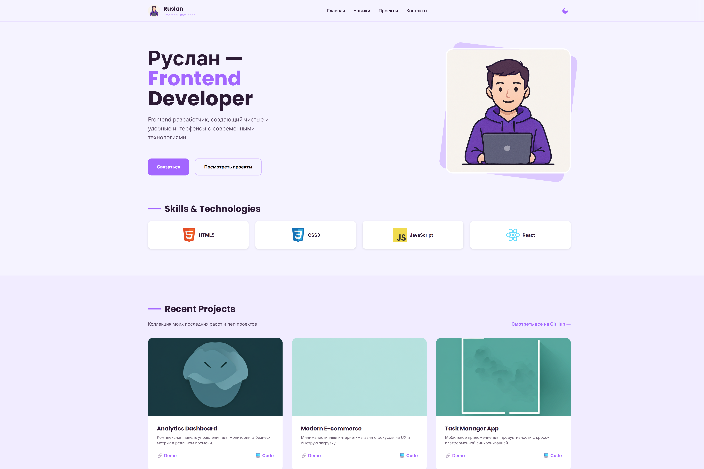

# Personal Portfolio — Ruslan An

Личный сайт-портфолио, созданный для демонстрации навыков фронтенд-разработки и верстки. 

🚀 **Живая ссылка на проект:** [https://an-ruslan.github.io](https://an-ruslan.github.io)

---

## 🖼 Preview
 

---

## 🛠 Технологии и навыки

### Frontend

### Tools & Others

---

## 📂 О проекте
Сайт представляет собой современный **Responsive Landing Page**, написанный на чистом стеке (Vanilla JS/CSS). 

**Ключевые особенности:**
* **Performance:** Высокая скорость загрузки за счет отсутствия тяжелых библиотек.
* **Responsive:** Полная адаптивность: от мобильных телефонов до широкоформатных мониторов.
* **Clean Code:** Семантическая верстка и соблюдение стандартов написания кода.

---

## 📧 Контакты
Буду рад обсудить интересные проекты или стажировку:
* **GitHub:** [@An-Ruslan](https://github.com/An-Ruslan)
* **Telegram:** [@DieDice](https://t.me/DieDice)
